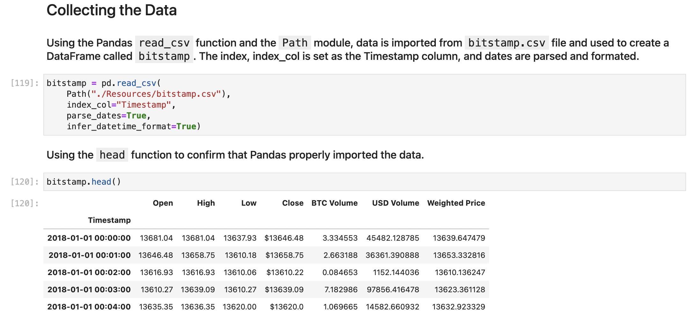
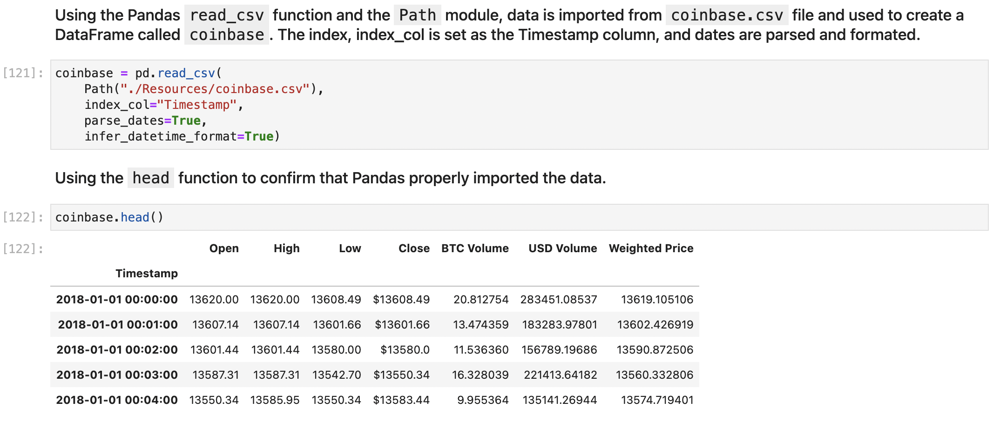
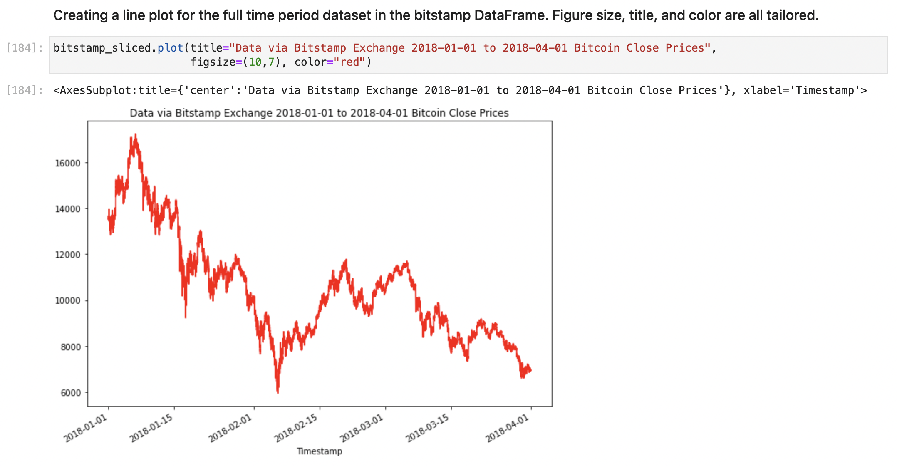
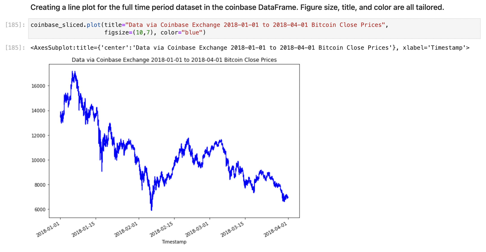
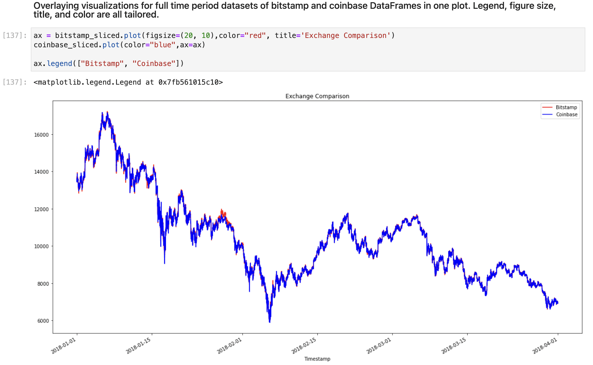

# Crypto Arbitrage

This Python application considers arbitrage opportunities in Bitcoin and other cryptocurrencies. As Bitcoin and other cryptocurrencies trade on markets across the globe, the Crypto Arbitrage application identifies arbitrage opportunities by sorting through historical trade data for Bitcoin on both Bitstamp and Coinbase and capitalizes on simultaneous price dislocations by using the power of Pandas and visualizations from Matplotlib Inline.

---

## Technologies

This project leverages python 3.7 with the following packages:

* [JupyterLab](https://jupyterlab.readthedocs.io/en/stable/) - JupyterLab is a web-based user interface designed for data analysis.

* [pandas](https://github.com/pandas-dev/pandas) - Flexible and powerful data analysis / manipulation library for Python.

* [matplotlib inline](https://github.com/matplotlib/matplotlib) - Comprehensive library for creating static, animated, and interactive visualizations in Python.

---

### Installation Guide

Before running the application first install the following dependencies.

```python
  pip install jupyterlab
  pip install pandas
  pip install matplotlib
```

---

## Examples

**Plotting Single Date bitstamp dataset.**
```
bitstamp_sliced.plot(title="Data via Bitstamp Exchange 2018-01-01
to 2018-04-01 Bitcoin Close Prices", figsize=(10,7), color="red")

```
**Plotting Full Time Period of both bitstamp and coinbase DataFrames for overlay comparison.**
```
ax = bitstamp_sliced.plot(figsize=(20, 10),color="red", title='Exchange Comparison')
coinbase_sliced.plot(color="blue",ax=ax)

ax.legend(["Bitstamp", "Coinbase"])

```

**Plotting Single Date dataset from both bitstamp and coinbase DataFrames for overlay comparison.**
```
bitstamp_sliced.loc['2018-01-01' : '2018-02-01'].plot(
    legend=True, figsize=(15, 10), title="Exchange Comparison (Earlier Time Period)",
    color="red", label="Bitstamp")
coinbase_sliced.loc['2018-01-01' : '2018-02-01'].plot(
    legend=True, figsize=(15, 10), color="blue", label="Coinbase")
```

**Calculating arbitrage spread of bitstamp and coinbase DataFrames, generating summary statistics of arbitrage in the early dataset.**
```
arbitrage_spread_early = coinbase_sliced.loc['2018-01-16'] - bitstamp_sliced.loc['2018-01-16']

arbitrage_spread_early.describe()

```

**Visualizing the arbitrage spread from early in the dataset in a box plot.**
```
arbitrage_spread_early.plot(kind='box', figsize=(10, 7), title="Arbitrage Spread - Jan 16, 2018")

```

**Calculating the potential profit, in dollars, per trade, any missing values from the resulting DataFrame are dropped.**
```
profit_early = profitable_trades_early * bitstamp_sliced.loc['2018-01-16']

profit_per_trade_early = profit_early.dropna()

profit_per_trade_early.head()
```

**Plotting the results for the early profit per trade DataFrame.**
```
profit_per_trade_early.plot(figsize=(10, 7), title="Profit Per Trade - Early Date", color="green")

```

---

## Usage

To use the Crypto Arbitrage application simply clone the repository and run the **crypto_arbitrage.ipynb** with JupyterLab:

Upon running the Crypto Arbitrage you will find below various .csv data-dependant results.











---

## Contributors

Brought to you by Robert Giannini.
LinkedIn: https://www.linkedin.com/in/robertgianninijr/

---

## License

MIT
